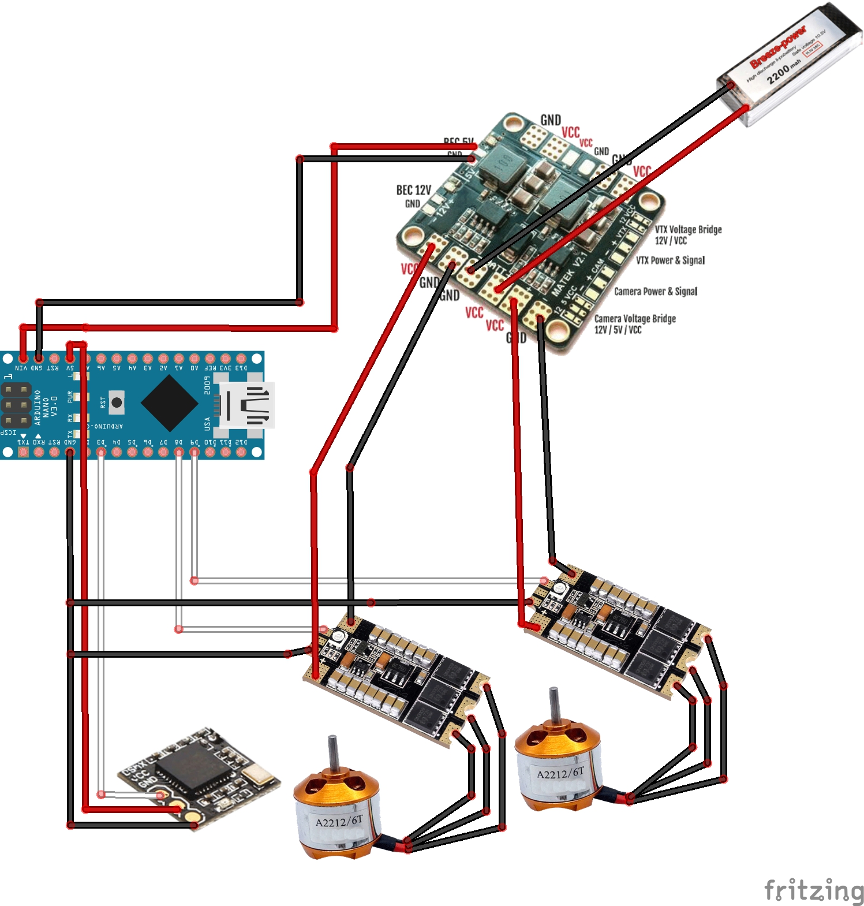
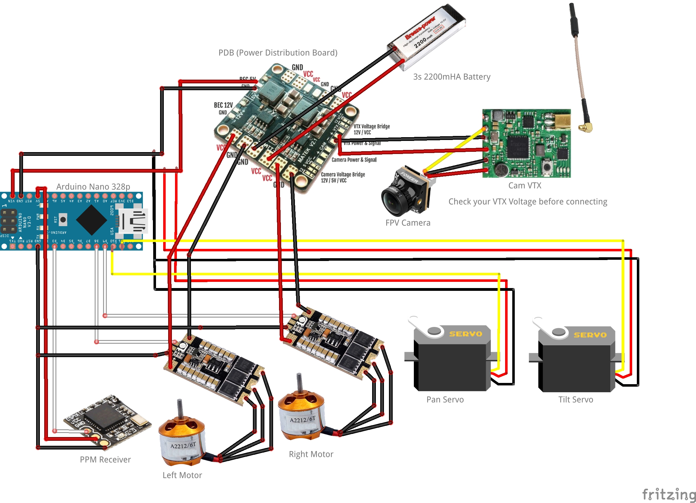

# Betacrawler

Facebook: [Betacrawler Community](https://www.facebook.com/groups/307432330496662)

Betacrawler is a RC tank controler firmware for arduino processors.  
Use [Atom](https://atom.io/) and the [Platform IO](https://platformio.org/) IDE to compile.  
If your not sure how to use PlatformIO here is a tutorial to get you started (https://youtu.be/EIkGTwLOD7o)

However if you still want to use the [Arduino IDE](https://www.arduino.cc/en/main/software) open the betacrawler/betacrawler.ino file and you 
can compile the project from there.

Betacrawler has a number of basic settings that can be changed in the configuration.h file.

There are 2 modes of operation available:
  - __Single Stick:__ Use a single stick to control the left right
            motors, leaving the other stick availalbe for cam pan/tilt.
  - __Dual Stick:__ Use both sticks to control the left and right motors indepentantly.

This project has been inspired by the [Betaflight](https://github.com/betaflight) FPV firmware.

## Configuration

To configure the firmware for your setup open the configuration.h file and edit
the required parameters as needed.

```cpp
/*
 * Serial baud rate
 */
#define SERIAL_BAUD             115200

/*
 * Your controller's minumim stick value
 */
#define RX_MIN                  1140

/*
 * Your controller's maxumim stick value
 */
#define RX_MAX                  1860

/*
 * A filter to reduce stick position noise
 * Increase this if you find erratic motor movements 
 *   when the stick is in a hold position.
 * 
 */
#define FLUTTER                 10

/*
 * Set the mode of operation.
 * MODE_SINGLE: Use the left stick for all motor throttle movement
 * MODE_DUAL: Use left and right as seperate throttles for each motor
 */
#define STICK_MODE              MODE_SINGLE

/*
 * If you are using a servo to move your camera enable this
 */
#define CAM_PAN_ENABLED         true        // Enable cam servo 0
#define CAM_TILT_ENABLED        true        // Enable cam servo 1

/*
 * If you want the pan/tilt to be diabled on disarm
 */
#define DISABLE_PAN_TILT_ON_DISARM
```

Also be sure to check the pins section to ensure you have your hardware connected correctly. 
You can change the default pins as requred.

```cpp
// ------------- PIN Configuration -------------

/*
 * PPM Receiver pin
 */
#define PPM_RX_PIN              3

/*
 * ESC pins
 */
#define ESC0_PIN                8
#define ESC1_PIN                9

/*
 * Servo 0 Use this servo for the pan of a cam mount.
 */
#define SVO0_PIN                11

/*
 * Servo 1 Use this servo for the tilt of a cam mount.
 */
#define SVO1_PIN                12

/*
 * LED Pin, used when the system is armed.
 */
#define LED_PIN                 13
```


## Hardware Setup

This is the setup I have used to get this project up and running, your project may differ. 
This should get you started if you are not sure how it all fits together.

This setup assumes that you already have a radio transmitter and know how to bind it up 
to your selected PPM receiver. This is the one used in testing [8CH Transmitter DSM2 Compatible](https://www.banggood.com/custlink/KGDYcLmCMg).  

The transmitter has also been modified to remove the spring on both left and right throttle sticks. 
This helps when using Dual Stick mode.

For Single Stick Mode the channels are configured for Transmitters using the left stick (MODE 2).   
You can change the channels in the configuration if you prefer to use the right stick (MODE 1).


#### Tank Model

To start with you will need a Tank model. If you have a 3D Printer and a bit of time on your hands
a fantastic starting model is the [RC Tank - By Staind](https://www.thingiverse.com/thing:2414983).

But I assume if you have come here then you have the model part sorted out already. ;-)


#### Step 1 - Arduino & PPM 

##### Parts
  * [Arduino Nano V3](https://www.banggood.com/custlink/mKDyWl3pU3)
  * [Arduino Nano Expansion Board](https://www.banggood.com/custlink/KKmRpavpqC) (optional: For bench testing)
  * [Tiny 2.4G DSM2 6CH PPM Receiver](https://www.banggood.com/custlink/GDmycOmcUI)

##### Wiring


#### Step 2 - ESC's

Note: If your ESC's have an onboard 5v BEC you can use that instad of using an external BEC on the PDB or similar.
      However it is reccomended to use the BEC's on you PDB where possible to reduce EMF noise.

##### Parts
  * [Matek Mini PDB With 5V/12V BEC](https://www.banggood.com/custlink/m3vErjGJM1)
  * [5V BEC 2-6S](https://www.banggood.com/custlink/mGDYJO3rfE) (Optional: not needed if PDB/ESC has 5v BEC)
  * [2 x Razor32 35A 3-6S ESC](https://www.banggood.com/custlink/v3GhrL3Jwc)
  * [2 x 2212 930KV 2-4s](https://www.banggood.com/custlink/mK3ypomrfZ)
  * [2200mAh 60C 3S Lipo](https://www.banggood.com/custlink/3GKyWLGtm5)

##### Wiring




#### Step 3 - FPV & Servos

The main thing to take note here is that you have connected the correct voltage to your VTX.
If it needs 5v you must connect to a 5v BEC from the PDB or ESC (if available).


##### Parts
  * [2 x SG90 Micro Servo 9g](https://www.banggood.com/custlink/DmDRJaGp76) (Optional: for pan/tilt functions)
  * [Foxeer Razer 1.8mm Lens 1200TVL](https://www.banggood.com/custlink/vvDyrOmpu2)
  * [AKK FX337CH 25/200/400/600mW VTX](https://www.banggood.com/custlink/m3mypOGH3m)
  * [SMA 5,8G Antenna](https://www.banggood.com/custlink/vGKRcOGPGc)

##### Wiring




### All Parts

All these parts are only suggestions, you will need get the parts that are right for you project.

The 5v BEC is only needed if you are not using a PDB (Power Distribution Board) with an onboard 5v Bec.

  * [Arduino Nano V3](https://www.banggood.com/custlink/mKDyWl3pU3)
  * [Arduino Nano Expansion Board](https://www.banggood.com/custlink/KKmRpavpqC) (optional: For bench testing)
  * [Tiny 2.4G DSM2 6CH PPM Receiver](https://www.banggood.com/custlink/GDmycOmcUI)
  * [Matek Mini PDB With 5V/12V BEC](https://www.banggood.com/custlink/m3vErjGJM1)
  * [5V BEC 2-6S](https://www.banggood.com/custlink/mGDYJO3rfE) (Optional: not needed if PDB/ESC has 5v BEC)
  * [2 x Razor32 35A 3-6S ESC](https://www.banggood.com/custlink/v3GhrL3Jwc)
  * [2 x 2212 930KV 2-4s](https://www.banggood.com/custlink/mK3ypomrfZ)
  * [2200mAh 60C 3S Lipo](https://www.banggood.com/custlink/3GKyWLGtm5)
  * [2 x SG90 Micro Servo 9g](https://www.banggood.com/custlink/DmDRJaGp76) (Optional: for pan/tilt functions)
  * [Foxeer Razer 1.8mm Lens 1200TVL](https://www.banggood.com/custlink/vvDyrOmpu2)
  * [AKK FX337CH 25/200/400/600mW VTX](https://www.banggood.com/custlink/m3mypOGH3m)
  * [SMA 5,8G Antenna](https://www.banggood.com/custlink/vGKRcOGPGc)
  * [8CH Transmitter DSM2 Compatible](https://www.banggood.com/custlink/KGDYcLmCMg)


## How To Contribute

If you would like to contribute contact me and let me know on github or facebook at 

My knowledge of C++ and arduino is limited and I would like to see where this project could go in the future.

If we get enough of a community we can grow the features of Betacrawler.

If your not into programming, and you still want to contribute, pleae consider supporting me through one of these options:

  * [PayPal](https://www.paypal.com/paypalme/tropotek)
  * [Patreon](https://www.patreon.com/tropotek)

Follow this project on [Facebook Group](https://www.facebook.com/groups/307432330496662) to ask any questions and any additions you would like to see.


## Resources Used
  - The tank model tested with betacrawler [RX Tank - By Staind](https://www.thingiverse.com/thing:2414983)
  - [PPM Reciver](https://github.com/Nikkilae/PPM-reader)
  - [ESC/Servo](https://www.instructables.com/id/ESC-Programming-on-Arduino-Hobbyking-ESC/)
  - [ESC bi-directional](https://www.youtube.com/watch?v=jBr-ZLMt4W4)
  - [ESC PWM Testing](https://github.com/MikeysLab/BrushlessESCviaPWM/blob/master/EscPWMTesting/EscPWMTesting.ino)
  - [Arduino ESC Lib](https://www.robotshop.com/community/blog/show/rc-speed-controller-esc-arduino-library)


