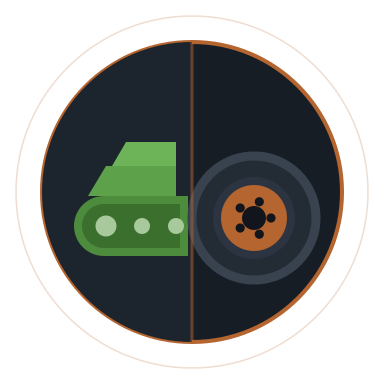
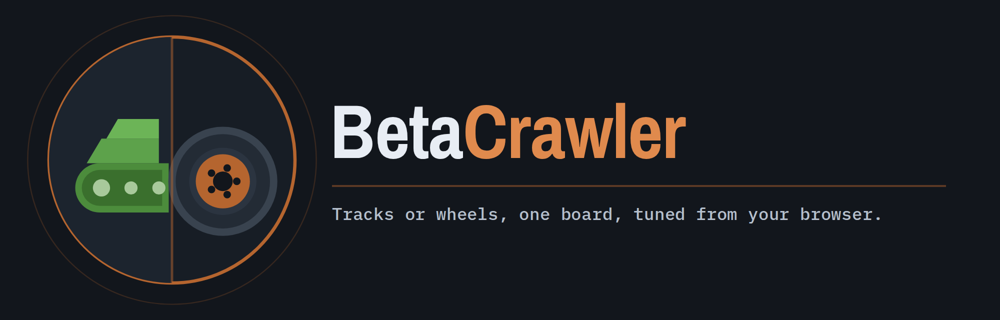
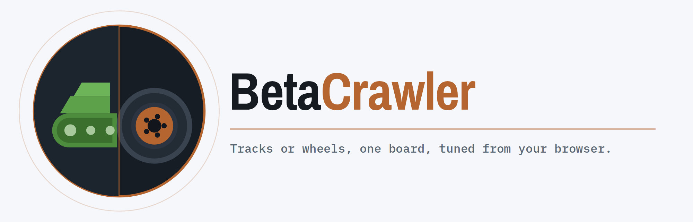
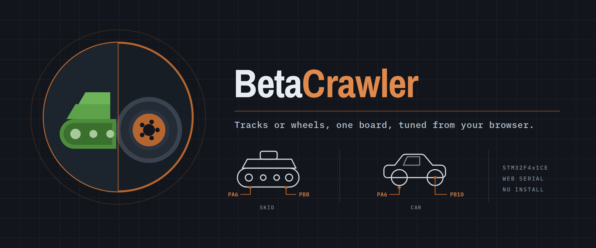

# About

BetaCrawler is a radio-controlled vehicle platform: an STM32 Black Pill reads your RC receiver,
mixes the sticks into motor commands, and drives either two independently driven sides or a drive
motor and a steering servo. Everything about how it behaves is set from a browser over USB, with
no software to install and no firmware rebuild.

It is free software under the **[GNU General Public License v3](https://www.gnu.org/licenses/gpl-3.0.html)**.
The source lives at **[github.com/tropotek/betacrawler](https://github.com/tropotek/betacrawler)** —
issues, discussions and pull requests are all welcome.

## The name

The project is **BetaCrawler** in writing. Lowercase `betacrawler` is the identifier — the
repository, the URL, the PlatformIO environments, and the `fw` string the firmware reports over
the wire. Both are correct in their own place.

## Logos

The mark is a circle split down the middle: tracked running gear on one side, a road wheel on the
other, for the two kinds of vehicle the firmware drives. Use whichever file suits — the SVGs are
the originals and scale to any size.

| Preview | Download |
|---|---|
| { .logo-preview }**Mark** — the badge on its own, transparent background. Use it where the name already appears elsewhere. | [SVG](assets/logos/betacrawler-mark.svg) · [512px](assets/logos/betacrawler-mark-512.png) · [256px](assets/logos/betacrawler-mark-256.png) · [128px](assets/logos/betacrawler-mark-128.png) |
| { .logo-preview }**Lockup, dark** — mark and wordmark together, for dark backgrounds. | [SVG](assets/logos/betacrawler-lockup-dark.svg) · [PNG](assets/logos/betacrawler-lockup-dark.png) |
| { .logo-preview }**Lockup, light** — the same, for light backgrounds. | [SVG](assets/logos/betacrawler-lockup-light.svg) · [PNG](assets/logos/betacrawler-lockup-light.png) |
| { .logo-preview }**Hero** — the full banner at 1200×500, with both drive modes and their pins. | [SVG](assets/logos/betacrawler-hero.svg) · [PNG](assets/logos/betacrawler-hero.png) |

Previews are scaled to fit; every file downloads at its full size.

The wordmark is set in **Archivo Narrow** Bold and the technical labels in **IBM Plex Mono**, both
under the SIL Open Font License. The SVGs carry those glyphs embedded as a subset, so they render
correctly without either font installed.

### Colours

| | Hex | Used for |
|---|---|---|
| Ink | `#12161c` | The ground everything sits on |
| Copper | `#b5652f` | The accent — rim, rules, the split |
| Copper light | `#e08a4d` | The accent on dark, and the *Crawler* half of the wordmark |
| Track green | `#4c8c3c` | The skid-steer half of the mark |
| Paper | `#e8edf4` | Type and line art on dark |

### Using them

The logos are covered by the same GPL-3.0 licence as the rest of the project, so you are free to
use, modify and redistribute them on those terms. Two requests that are courtesy rather than
licence conditions:

- Don't restyle the mark and keep the name — recolour it, redraw it, or fork it under a different
  name, but a modified mark presented as BetaCrawler's confuses people trying to find the project.
- Don't imply endorsement. Using the logo to link here is welcome; using it to suggest this
  project vouches for yours is not.

## Credits

Built on [PlatformIO](https://platformio.org/) and the
[STM32duino](https://github.com/stm32duino/Arduino_Core_STM32) core, documented with
[MkDocs](https://www.mkdocs.org/) and [Material for MkDocs](https://squidfunk.github.io/mkdocs-material/).
The configurator's DFU implementation follows the approach taken by
[Betaflight Configurator](https://github.com/betaflight/betaflight-configurator).

&nbsp;
