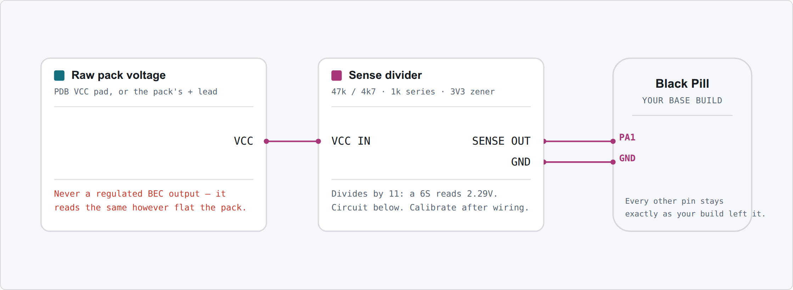

# Battery sense

Reports pack voltage to your handset over telemetry and to the Configurator's Configuration page.
The vehicle drives perfectly well without it — fit it if you want to know how much charge is left
without unplugging anything.

It suits any of the four base builds. All it needs is the pack's raw voltage and one free pin.

## Wiring

A LiPo is far above the 3.3 V the board's ADC can read, so a resistor divider scales it down. Tap
raw pack voltage — the PDB's **VCC** pad on a build that has a PDB, or the pack's own positive lead
on one that does not — and bring the divider's output to **PA1**.

{target=_blank}

**Click the diagram to open it full size** in a new tab.

!!! warning "Tap a raw pack pad"

    Never a regulated BEC output. A regulator holds its output steady as the pack drains, so the
    reading would look healthy right up until the vehicle stops.

## The divider

{target=_blank}

| Part | Value | Notes |
|---|---|---|
| High side | 47 kΩ | 1% metal film |
| Low side | 4.7 kΩ | 1% metal film, same family as the high side |
| Series | 1 kΩ | Protects PA1 if the low side ever goes open circuit |
| Filter | 100 nF | Ceramic, marked `104` |
| Clamp | 3.3 V zener | **Band to the tap.** Fitted backwards it pins the reading at 0.7 V |

47k/4k7 divides by exactly 11: a 4S reads 1.53 V and a 6S 2.29 V, both comfortably inside range,
and nothing reaches the clamp below 36.3 V. Use metal film rather than carbon — calibration cancels
a resistor's tolerance but not its drift with temperature.

### Using a PDB that already has a sense output

Some power distribution boards bring out a divided pack voltage of their own. If yours does, skip
the components above: wire that pin to **PA1** and calibrate. The firmware only ever multiplies
what it reads at the pin, so it does not care who did the dividing.

Check the PDB's output at **full charge**, not its nominal ratio — it has to stay under 3.3 V. A
1:10 output reads 2.52 V on a 6S, a 1:11 output 2.29 V, both fine. Set `VBAT_SCALE_DEFAULT` in your
board header to that ratio × 1000, so an uncalibrated board starts close.

The 1 kΩ series resistor and the zener are still worth fitting. If the PDB's output is already
under 3.3 V the zener never conducts, and both cost pennies against a dead pin.

## Settings

| Setting | Key | Value | Why |
|---|---|---|---|
| Source | `vbat.source` | `adc` | Read the real pin. Already the default. |
| Cells | `vbat.cells` | `auto` | Infers cell count from the voltage at power-on. Already the default. |
| Scale | `vbat.scale` | calibrated | Set by calibration, below. |

Once it is wired, calibrate it: read the pack with a multimeter, enter that voltage on the
**Configuration** page, and the scale is adjusted so the board agrees. Press **Save to flash**.

Set `vbat.cells` explicitly if you always fly the same pack and want the per-cell readout to stay
right even when you connect a nearly flat one — `auto` can guess a 6S at rest for a 5S that is
freshly charged.
