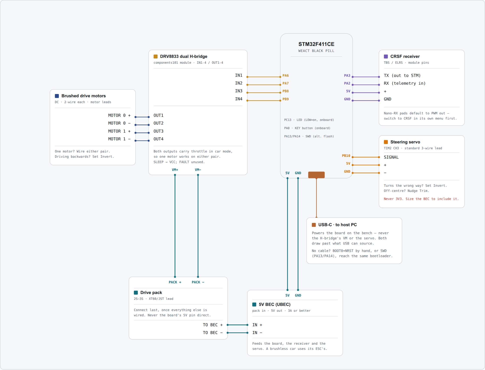

# Car with a brushed motor

One brushed motor through an H-bridge module, plus a steering servo. This is the build for a donor
RC car: the chassis, servo and motor are already there, and only the electronics change.

The one thing this build needs that the others do not is a 5 V supply of its own for the servo —
there is no ESC BEC to borrow. If you would rather avoid that, [brushless](brushless.md) solves it
by using the ESC's BEC.

## Parts

| Part | Qty | What matters |
|---|---|---|
| WeAct Black Pill, STM32F411CE or STM32F401CE | 1 | The USB-C revision. Both chips are supported — see below. |
| ELRS receiver | 1 | Must expose a CRSF-capable output pad. Crossfire works too. |
| Dual H-bridge module, DRV8833-class | 1 | Rated for your motor's **stall** current, not its running current. One module covers one or two motors. |
| Brushed motor | 1 | Two if you are driving both wheels; wire one to each motor pin. |
| 10 kΩ resistor | 4 | Pulldowns on the H-bridge inputs. See the warning below. |
| Steering servo | 1 | Any standard hobby servo. |
| 5 V BEC | 1 | Powers the servo and the board. A UBEC off the pack is the usual answer. |
| Battery pack | 1 | Sized for the motor. Feeds the H-bridge directly. |
| USB-C cable | 1 | A data cable. Charge-only cables are a common and confusing failure. |

You also need a computer running a Chromium-based browser — Chrome, Edge, Brave or Opera. That is
what the configurator runs in, and it is the only kind of browser that can talk to the board. No
programmer, and nothing to install.

--8<-- "_shared/which-black-pill.md"

--8<-- "_shared/hbridge-pulldowns.md"

## Wiring

The pack feeds the H-bridge directly. A separate 5 V BEC feeds the board, the receiver and the
servo.

{target=_blank}

**Click the diagram to open it full size** in a new tab, where every pin label is readable. This is
a schematic map, not a picture of the board — match connections by pin label, not by position on
the diagram.

| Signal | Board pin | Goes to |
|---|---|---|
| Motor 0, pin A | PA6 | H-bridge IN1 |
| Motor 0, pin B | PA7 | H-bridge IN2 |
| Motor 1, pin A | PB8 | H-bridge IN3, for a second driven wheel |
| Motor 1, pin B | PB9 | H-bridge IN4 |
| Steering servo | PB10 | Servo signal wire |
| Receiver | PA3 | The receiver's CRSF **TX** pad |
| Telemetry | PA2 | The receiver's CRSF **RX** pad |
| Board power | 5V, GND | The 5 V BEC output |
| Status LED | PC13 | On the board already, nothing to wire |

Both motor outputs carry throttle in car mode, so a single motor drives whichever pair of pins it
is wired to, and a two-wheel-drive car works by wiring both.

The two Black Pill variants are pin-compatible, so everything here is the same whichever chip you
have. Only the firmware image differs.

--8<-- "_shared/sleep-pin.md"

--8<-- "_shared/receiver-and-crsf.md"

--8<-- "_shared/common-ground.md"

## Steering servo

The servo's signal wire goes to **PB10**. Its + and − go to the same 5 V rail the board runs
from — the Black Pill's 5V pin is that rail, not a regulator output, so tapping it there and
tapping the BEC directly are the same connection. **Never run a servo from the board's 3V3 pin**;
that one *is* a regulator output, and it is neither the right voltage nor able to supply the
current.

What matters is the BEC's rating: it carries the board, the receiver and the servo together, and a
servo under load is by far the largest of the three. Size it for all three, not for the board.

On stock settings the servo follows the mixer's steer output, so it works as soon as Drive Mode is
`car`.

If the wheels steer the wrong way, set `Invert` on the servo rather than turning the horn round. If
they sit off-straight with the stick centred, nudge `Trim`.

## Power

- **Pack → H-bridge.** The pack's positive and negative go to the module's VM and GND. Watch the
  polarity; most modules have no reverse protection.
- **Pack → BEC → board, receiver, servo.** The BEC takes pack voltage and gives 5 V. Everything
  that is not a drive motor runs from it.
- **H-bridge → motor.** Two wires, OUT1/OUT2. If the wheels drive backwards, use the motor's
  `Invert` setting rather than swapping them.

--8<-- "_shared/never-board-5v.md"

## Configuration

Both motors ship with `Type` set to `none`, so a freshly flashed board drives nothing at all. Set
these on the **Configuration** page, then press **Save to flash**:

| Setting | Key | Value | Why |
|---|---|---|---|
| Drive Mode | `drive.mode` | `car` | Throttle to both motor outputs, steering to the servo, unmixed. |
| Motor 0 Type | `motor0.type` | `brushed` | Drives PA6/PA7 as an H-bridge pair. |
| Motor 1 Type | `motor1.type` | `brushed` | The same on PB8/PB9, for a second driven wheel. |

--8<-- "_shared/hbridge-type-warning.md"

The firmware drives the steering servo whenever Drive Mode is `car`, so there is no servo
setting to remember — in the app, from the Terminal, or in an INI.

Rather than typing these in: download **[car-brushed.ini](../../assets/presets/car-brushed.ini)**
and restore it from the **Terminal** page's **Restore from INI** button, then press **Save to
flash**. It sets exactly the rows above and leaves everything else at its default.

Two further settings appear once `Type` is `brushed`. `Switch Freq` (`motor0.freq`) sets the PWM
frequency, 20 kHz by default, which is above hearing; drop it only if your module cannot switch
that fast. `At Zero` (`motor0.brake`) chooses whether a stopped motor coasts or brakes.

## Next

Flash the board: [Flashing the firmware](../flashing.md).

Then [Connect to the board](../../drive/install-and-connect.md) and work through
[First setup](../../drive/first-setup.md).

Optional hardware lives under [Add-ons](../../addons/index.md).
