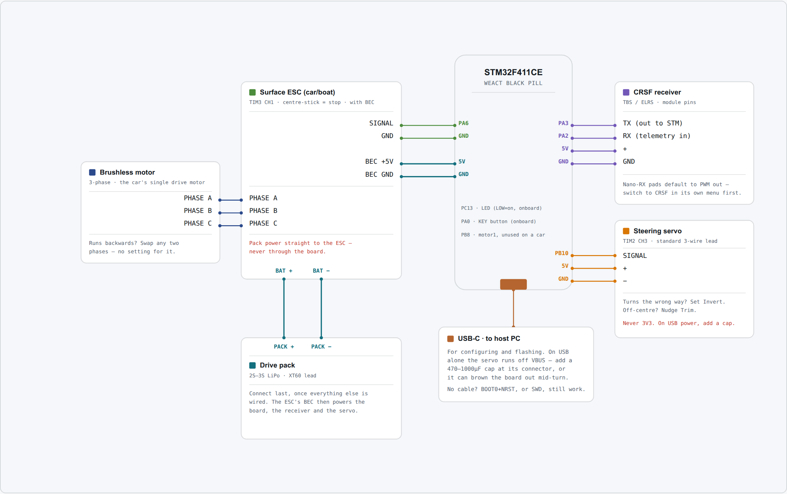

# Car with a brushless motor

One brushless motor on a surface ESC, plus a steering servo. The ESC's own BEC powers the board,
the receiver and the servo, which makes this the simplest car build on the power side.

If your donor car already has a brushed motor, [brushed](brushed.md) needs less new hardware.

## Parts

| Part | Qty | What matters |
|---|---|---|
| WeAct Black Pill, STM32F411CE or STM32F401CE | 1 | The USB-C revision. Both chips are supported — see below. |
| ELRS receiver | 1 | Must expose a CRSF-capable output pad. Crossfire works too. |
| Brushless ESC | 1 | A surface ESC, or a BLHeli_S drone ESC that supports **bidirectional** mode. Its BEC feeds the board, receiver and servo. |
| Brushless motor | 1 | Two if you are driving both wheels; wire one to each motor pin. |
| Steering servo | 1 | Any standard hobby servo. |
| LiPo battery | 1 | Sized for the motor. Feeds the ESC. |
| USB-C cable | 1 | A data cable. Charge-only cables are a common and confusing failure. |

You also need a computer running a Chromium-based browser — Chrome, Edge, Brave or Opera. That is
what the configurator runs in, and it is the only kind of browser that can talk to the board. No
programmer, and nothing to install.

--8<-- "_shared/which-black-pill.md"

--8<-- "_shared/esc-centre-stick.md"

## Wiring

The battery feeds the ESC, the ESC's BEC feeds the board, and the receiver and servo take their
power from the board's 5 V rail in turn.

{target=_blank}

**Click the diagram to open it full size** in a new tab, where every pin label is readable. This is
a schematic map, not a picture of the board — match connections by pin label, not by position on
the diagram.

| Signal | Board pin | Goes to |
|---|---|---|
| Motor 0 | PA6 | ESC signal wire |
| Motor 1 | PB8 | A second ESC's signal wire, if you are driving both wheels |
| Steering servo | PB10 | Servo signal wire |
| Receiver | PA3 | The receiver's CRSF **TX** pad |
| Telemetry | PA2 | The receiver's CRSF **RX** pad |
| Board power | 5V, GND | The ESC's BEC output |
| Status LED | PC13 | On the board already, nothing to wire |

Both motor outputs carry throttle in car mode, so a single motor drives whichever of PA6 or PB8 it
is wired to, and a two-wheel-drive car works by wiring both.

The two Black Pill variants are pin-compatible, so everything here is the same whichever chip you
have. Only the firmware image differs.

--8<-- "_shared/receiver-and-crsf.md"

--8<-- "_shared/common-ground.md"

## Steering servo

The servo's signal wire goes to **PB10**. Its power comes from the ESC's BEC — the same 5 V that
feeds the board — and its ground is shared with everything else. **Never run a servo from the
board's 3V3 pin**; it is neither the right voltage nor able to supply the current.

On stock settings the servo follows the mixer's steer output, so it works as soon as Drive Mode is
`car`.

If the wheels steer the wrong way, set `Invert` on the servo rather than turning the horn round. If
they sit off-straight with the stick centred, nudge `Trim`.

## Power

- **Battery → ESC.** Connect it last, once everything else is wired.
- **ESC → motor.** Three wires, in any order. If the wheels drive backwards, swap any two.
- **ESC BEC → board.** The BEC's red and black go to the board's 5V and GND. The receiver and the
  servo draw from that same rail.

USB can stay plugged in with the battery connected — that is how you tune while the car is on the
bench.

--8<-- "_shared/never-board-5v.md"

## Configuration

Both motors ship with `Type` set to `none`, so a freshly flashed board drives nothing at all. Set
these on the **Configuration** page, then press **Save to flash**:

| Setting | Key | Value | Why |
|---|---|---|---|
| Drive Mode | `drive.mode` | `car` | Throttle to both motor outputs, steering to the servo, unmixed. |
| Motor 0 Type | `motor0.type` | `brushless` | Sends an ESC pulse train on PA6. |
| Motor 1 Type | `motor1.type` | `brushless` | The same on PB8, for a second driven wheel. |

The firmware drives the steering servo whenever Drive Mode is `car`, so there is no servo
setting to remember — in the app, from the Terminal, or in an INI.

Rather than typing these in: download **[car-brushless.ini](../../assets/presets/car-brushless.ini)**
and restore it from the **Terminal** page's **Restore from INI** button, then press **Save to
flash**. It sets exactly the rows above and leaves everything else at its default.

## Next

Flash the board: [Flashing the firmware](../flashing.md).

Then [Connect to the board](../../drive/install-and-connect.md) and work through
[First setup](../../drive/first-setup.md).

Optional hardware lives under [Add-ons](../../addons/index.md).
