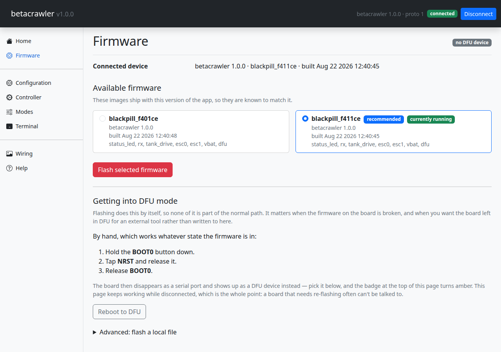

# Flashing the firmware

The first flash needs an ST-Link. After that, the configurator updates the board over USB and you
will not need the programmer again.

## Why the first one is different

The one-click firmware update works by asking the running firmware to reboot into the STM32's
built-in USB bootloader. A blank board has no firmware to ask, so the first image has to go in
over SWD with a programmer.

## Wiring the ST-Link

Four wires from the ST-Link/V2 to the header on the short edge of the board:

| ST-Link | Board |
|---|---|
| SWDIO | PA13 |
| SWCLK | PA14 |
| GND | GND |
| 3.3V | 3V3 |

## Pick the build for your chip

There is one build environment per Black Pill variant, and they are not interchangeable:

| Your chip | Environment |
|---|---|
| STM32F411CE | `blackpill_f411ce` |
| STM32F401CE | `blackpill_f401ce` |

Read the marking on the chip itself rather than trusting the listing you bought it from — see
[Which Black Pill](what-you-need.md#which-black-pill). An F411 image on an F401 hard-faults at
boot and the board never enumerates over USB at all, which looks exactly like a dead board.

## Build and upload

PlatformIO does both. It is not on your `PATH` by default, so call it by its full path, and
substitute your own environment for `blackpill_f411ce` if you have the F401:

```bash
cd firmware
~/.platformio/penv/bin/pio run -e blackpill_f411ce
~/.platformio/penv/bin/pio run -e blackpill_f411ce -t upload
```

The first command compiles and the second flashes. If you have two ST-Link units plugged in and
it grabs the wrong one, add `upload_port = <device>` under `[env:blackpill_f411ce]` in
`firmware/platformio.ini`.

## Checking it worked

Unplug the ST-Link and power the board over USB. The onboard LED should settle into an even
one-beat-per-second blink — that is the firmware reporting itself healthy. Anything faster means
a fault; see [Status LED](../reference/status-led.md).

Connect the configurator and open the **Help** page: it names the board the running firmware was
built for, which is the confirmation that you flashed the right one.

## Updating later



Once the board runs Betacrawler, updates go through the **Firmware** page in the configurator, over
USB. No programmer, no wires to move. The app carries an image for each supported board and offers
the one matching the board you last connected; it reboots the board into its bootloader, writes the
image and lets the board restart itself.

The first flash from a given browser asks you to pick the STM32 bootloader in a device picker, the
same way connecting does. After that it is remembered.

On Windows, a board in bootloader mode has to be bound to the WinUSB driver before a browser can
see it. Use [Zadig](https://zadig.akeo.ie/) once, on the `STM32 BOOTLOADER` device. Linux and
macOS need nothing.

That page stays available even when no device is connected, on purpose: it is the recovery tool,
so gating it on a working device would be backwards.

## Recovering a board that will not come back

The bootloader lives in ROM and runs whatever state the firmware is in — including a board flashed
with the wrong chip's image. Reach it by hand: hold **BOOT0**, tap **NRST**, release **BOOT0**.
The board then appears as a DFU device, and the **Firmware** page can write to it with nothing
else connected.

Next: [Connect to the board](../drive/install-and-connect.md).
