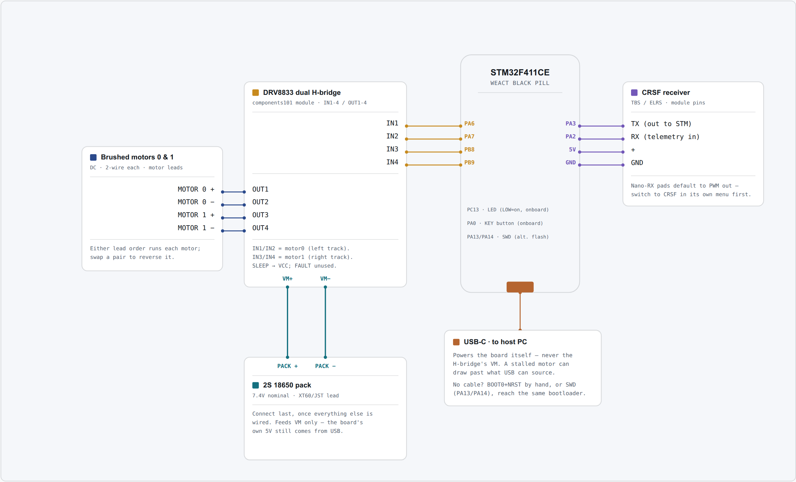

# Skid steer with brushed motors

Two brushed motors driven through a single dual H-bridge module. This is the cheapest and simplest
way into Betacrawler: one module drives both sides, reverse comes free, and there is no ESC to
configure.

If your chassis is heavy enough that a brushed motor would stall, [brushless](brushless.md) is the
build to follow instead.

## Parts

| Part | Qty | What matters |
|---|---|---|
| WeAct Black Pill, STM32F411CE or STM32F401CE | 1 | The USB-C revision. Both chips are supported — see below. |
| ELRS receiver | 1 | Must expose a CRSF-capable output pad. Crossfire works too. |
| Dual H-bridge module, DRV8833-class | 1 | Four inputs, four outputs. Rated for your motors' **stall** current, not their running current. |
| Brushed motor | 2 | Matched to each other, so the two sides respond alike. |
| 10 kΩ resistor | 4 | Pulldowns on the H-bridge inputs. See the warning below. |
| Battery pack | 1 | Sized for the motors. Feeds the H-bridge directly. |
| USB-C cable | 1 | A data cable. Charge-only cables are a common and confusing failure. |

No power distribution board, and no ESCs. You also need a computer running a Chromium-based
browser — Chrome, Edge, Brave or Opera. That is what the configurator runs in, and it is the only
kind of browser that can talk to the board. No programmer, and nothing to install.

A skid-steer pivot stalls both sides against each other, which is the highest current the module
will ever see. Size it for that.

--8<-- "_shared/which-black-pill.md"

--8<-- "_shared/hbridge-pulldowns.md"

## Wiring

The pack feeds the H-bridge module directly. The board's own 5 V comes from USB or from the
receiver's supply — a brushed build does not power the board from the drive pack.

{target=_blank}

**Click the diagram to open it full size** in a new tab, where every pin label is readable. This is
a schematic map, not a picture of the board — match connections by pin label, not by position on
the diagram.

| Signal | Board pin | Goes to |
|---|---|---|
| Motor 0, pin A | PA6 | H-bridge IN1 — the **left** side |
| Motor 0, pin B | PA7 | H-bridge IN2 |
| Motor 1, pin A | PB8 | H-bridge IN3 — the **right** side |
| Motor 1, pin B | PB9 | H-bridge IN4 |
| Receiver | PA3 | The receiver's CRSF **TX** pad |
| Telemetry | PA2 | The receiver's CRSF **RX** pad |
| Board power | 5V, GND | USB, or the receiver's own supply |
| Status LED | PC13 | On the board already, nothing to wire |

The two Black Pill variants are pin-compatible, so everything here is the same whichever chip you
have. Only the firmware image differs.

--8<-- "_shared/sleep-pin.md"

--8<-- "_shared/receiver-and-crsf.md"

--8<-- "_shared/common-ground.md"

## Power

- **Pack → H-bridge.** The pack's positive and negative go to the module's VM and GND. Watch the
  polarity; most modules have no reverse protection.
- **H-bridge → motors.** Two wires per motor, OUT1/OUT2 for the left side and OUT3/OUT4 for the
  right.
- **Board → USB.** The board takes its 5 V from USB while you are setting it up, and from the
  receiver's supply once it is running untethered.

--8<-- "_shared/never-board-5v.md"

## Configuration

Both motors ship with `Type` set to `none`, so a freshly flashed board drives nothing at all. Set
these on the **Configuration** page, then press **Save to flash**:

| Setting | Key | Value | Why |
|---|---|---|---|
| Drive Mode | `drive.mode` | `skid` | Mixes throttle and steering into two independent side commands. Already the default. |
| Motor 0 Type | `motor0.type` | `brushed` | Drives PA6/PA7 as an H-bridge pair. |
| Motor 1 Type | `motor1.type` | `brushed` | The same on PB8/PB9. |
| Servo | `servo.mode` | `off` | No steering servo on a skid-steer vehicle. Already the default. |

--8<-- "_shared/hbridge-type-warning.md"

Rather than typing these in: download **[skid-brushed.ini](../../assets/presets/skid-brushed.ini)**
and restore it from the **Terminal** page's **Restore from INI** button, then press **Save to
flash**. It sets exactly the rows above and leaves everything else at its default.

Two further settings appear once `Type` is `brushed`. `Switch Freq` (`motor0.freq`) sets the PWM
frequency, 20 kHz by default, which is above hearing; drop it only if your module cannot switch
that fast. `At Zero` (`motor0.brake`) chooses whether a stopped motor coasts or brakes.

### Which side is which

`motor0` drives the left side and `motor1` the right. If they turn out swapped once you are
driving, you do not need to rewire: swap `motor0.src` and `motor1.src` between `drive_left` and
`drive_right` from the Terminal.

If a single side runs backwards, set that motor's `Invert` on the Configuration page rather than
swapping leads.

## Next

Flash the board: [Flashing the firmware](../flashing.md).

Then [Connect to the board](../../drive/install-and-connect.md) and work through
[First setup](../../drive/first-setup.md).

Optional hardware lives under [Add-ons](../../addons/index.md).
