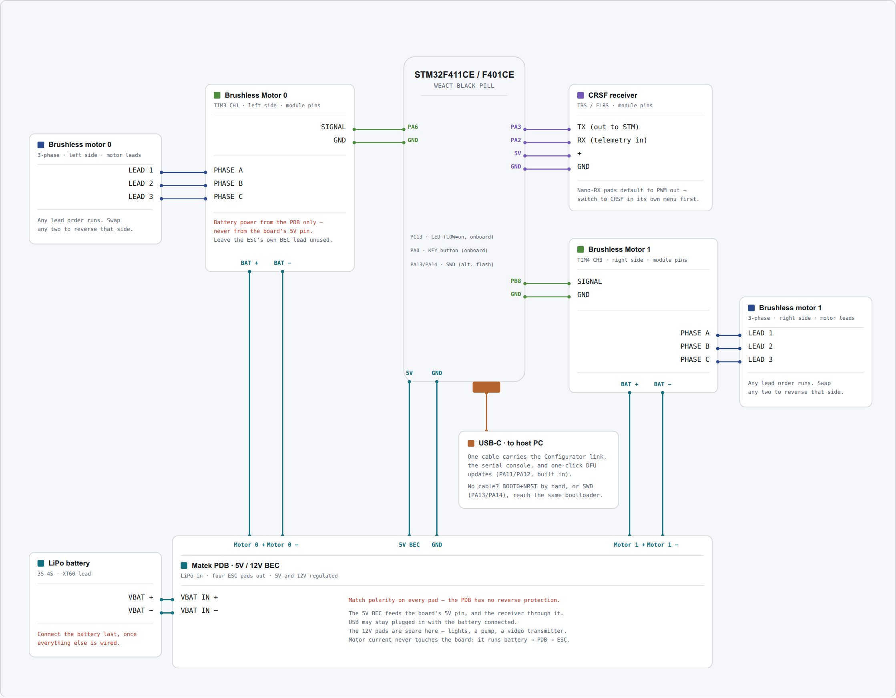

# Skid steer with brushless motors

Two brushless motors, one ESC each, driven from a power distribution board. This is the build for
a chassis heavy enough that a brushed motor would stall — a large tracked model, a 4WD rover, or
anything you want real torque from.

If your chassis is small or toy-derived, [brushed](brushed.md) is cheaper and simpler.

## Parts

| Part | Qty | What matters |
|---|---|---|
| WeAct Black Pill, STM32F411CE or STM32F401CE | 1 | The USB-C revision. Both chips are supported — see below. |
| ELRS receiver | 1 | Must expose a CRSF-capable output pad. Crossfire works too. |
| Brushless ESC | 2 | A surface ESC, or a BLHeli_S drone ESC that supports **bidirectional** mode. One per side. |
| Brushless motor | 2 | Sized for your chassis, matched to the ESCs' current rating, and matched to each other. |
| Power distribution board | 1 | With a 5 V BEC. The reference build uses a Matek PDB with 5 V and 12 V outputs. |
| LiPo battery | 1 | Sized for the motors. Feeds the PDB, **not** the board directly. |
| USB-C cable | 1 | A data cable. Charge-only cables are a common and confusing failure. |

You also need a computer running a Chromium-based browser — Chrome, Edge, Brave or Opera. That is
what the configurator runs in, and it is the only kind of browser that can talk to the board. No
programmer, and nothing to install.

--8<-- "_shared/which-black-pill.md"

--8<-- "_shared/esc-centre-stick.md"

## Wiring

The battery feeds a power distribution board, the PDB feeds both ESCs and the board's 5 V rail,
each ESC drives its motor on three wires, and the receiver and USB go straight to the board.

{target=_blank}

**Click the diagram to open it full size** in a new tab, where every pin label is readable. This is
a schematic map, not a picture of the board — match connections by pin label, not by position on
the diagram.

| Signal | Board pin | Goes to |
|---|---|---|
| Motor 0 | PA6 | Motor 0 signal wire — the **left** side |
| Motor 1 | PB8 | Motor 1 signal wire — the **right** side |
| Receiver | PA3 | The receiver's CRSF **TX** pad |
| Telemetry | PA2 | The receiver's CRSF **RX** pad |
| Receiver power | 5V, GND | The receiver's + and − |
| Board power | 5V, GND | The PDB's 5 V BEC output |
| Status LED | PC13 | On the board already, nothing to wire |

The two Black Pill variants are pin-compatible, so everything here is the same whichever chip you
have. Only the firmware image differs.

--8<-- "_shared/receiver-and-crsf.md"

--8<-- "_shared/common-ground.md"

## Power

Everything with current in it hangs off the PDB, and the board sits outside that path:

- **Battery → PDB.** The LiPo's XT60 goes to the PDB's battery input pads. Connect it last, once
  everything else is wired.
- **PDB → ESCs.** Each ESC's thick red and black leads solder to a pair of the PDB's ESC pads.
  Watch the polarity — a PDB has no reverse protection.
- **PDB → board.** The PDB's 5 V BEC output goes to the board's 5V and GND pins. The receiver takes
  its power from the board's 5V pin in turn, so the BEC feeds it too.
- **ESC → motor.** Three wires per motor, in any order.

The 12 V BEC output is spare in this build. It is there for lights, a pump, or a video transmitter
if you add one. It is **not** a voltage-sense point: being regulated, it reads the same whatever
the pack is doing.

USB can stay plugged in with the battery connected — that is how you tune while the vehicle is on
the bench.

--8<-- "_shared/never-board-5v.md"

## Configuration

Both motors ship with `Type` set to `none`, so a freshly flashed board drives nothing at all. Set
these on the **Configuration** page, then press **Save to flash**:

| Setting | Key | Value | Why |
|---|---|---|---|
| Drive Mode | `drive.mode` | `skid` | Mixes throttle and steering into two independent side commands. Already the default. |
| Motor 0 Type | `motor0.type` | `brushless` | Sends an ESC pulse train on PA6. |
| Motor 1 Type | `motor1.type` | `brushless` | The same on PB8. |

Rather than typing these in: download
**[skid-brushless.ini](../../assets/presets/skid-brushless.ini)** and restore it from the
**Terminal** page's **Restore from INI** button, then press **Save to flash**. It sets exactly the
rows above and leaves everything else at its default.

### Which side is which

`motor0` drives the left side and `motor1` the right. If they turn out swapped once you are
driving, you do not need to rewire: swap `motor0.src` and `motor1.src` between `drive_left` and
`drive_right` from the Terminal.

If a single side runs backwards, set that motor's `Invert` on the Configuration page, or swap any
two of the three motor wires on that ESC.

## Next

Flash the board: [Flashing the firmware](../flashing.md).

Then [Connect to the board](../../drive/install-and-connect.md) and work through
[First setup](../../drive/first-setup.md).

Optional hardware lives under [Add-ons](../../addons/index.md).
