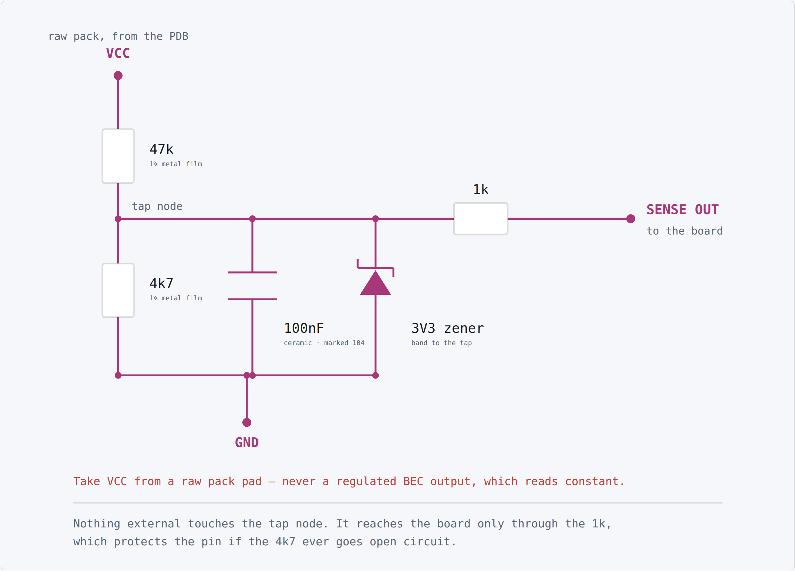

# Wiring

The battery feeds a power distribution board, the PDB feeds both ESCs and the board's 5V rail,
each ESC drives its motor on three wires, and the receiver and USB go straight to the board.

{target=_blank}

**Click the diagram to open it full size** in a new tab, where every pin label is readable.

This is a schematic map, not a picture of the board. Match connections by pin label, not by
position on the diagram.

## Pin map

| Signal | Board pin | Goes to |
|---|---|---|
| ESC 0 | PA6 | ESC 0 signal wire — the **left** track |
| ESC 1 | PB6 | ESC 1 signal wire — the **right** track |
| Receiver | PA10 | The receiver's CRSF **TX** pad |
| Receiver power | 5V, GND | The receiver's + and − |
| Board power | 5V, GND | The PDB's 5V BEC output |
| Telemetry | PA9 | The receiver's CRSF **RX** pad |
| Battery sense *(optional)* | PA1 | The sense divider's output |
| Status LED | PC13 | On the board already, nothing to wire |

PA9 is the board's CRSF transmit line. It carries telemetry back to your handset &mdash; pack
voltage today, and anything added later.

Both ESC grounds connect to the board's ground.

## The power chain

Everything with current in it hangs off the PDB, and the board sits outside that path:

- **Battery → PDB.** The LiPo's XT60 goes to the PDB's battery input pads. Connect it last, once
  everything else is wired.
- **PDB → ESCs.** Each ESC's thick red and black leads solder to a pair of the PDB's ESC pads.
  Watch the polarity — a PDB has no reverse protection.
- **PDB → board.** The PDB's 5V BEC output goes to the board's 5V and GND pins. The receiver takes
  its power from the board's 5V pin in turn, so the BEC feeds it too.
- **ESC → motor.** Three wires per motor, in any order.

The 12V BEC output is spare in this build. It is there for lights, a pump, or a video transmitter
if you add one. It is **not** a voltage-sense point: being regulated, it reads the same whatever
the pack is doing.

USB can stay plugged in with the battery connected — that is how you tune while the vehicle is on
the bench.

!!! warning "Power the ESCs from the PDB, never from the board's 5V pin"

    An ESC under load draws far more current than the board's 5V rail can supply. The board
    browns out, USB drops, and the app shows a disconnect — so it looks like a software or cable
    problem rather than the electrical one it is.

    The ESCs still need a **common ground** with the board, which the PDB's ground gives them. The
    signal wires have no reference without it, and the ESCs read noise.

    If your ESCs have their own BEC lead — the red wire on the servo connector — leave it
    disconnected. The PDB already supplies the board's 5V.

!!! warning "The receiver's pads ship in PWM mode"

    Out of the box, a receiver's output pads are configured as PWM servo outputs. One pad must be
    reassigned to CRSF in the receiver's own configuration menu. Until you do, nothing arrives on
    the wire at all and every channel reads empty — with no error to tell you why.

## Which track is which

`esc0` drives the left track and `esc1` the right. If they turn out swapped once you are driving,
you do not need to rewire: change `esc0.src` and `esc1.src` between `drive_left` and
`drive_right` in the app.

If a single track runs backwards, swap any two of the three motor wires on that ESC.

Next: [Flashing the firmware](flashing.md).

## Battery sense (optional)

The vehicle drives without this. Fit it if you want pack voltage on your transmitter and in the
Configurator.

A LiPo is far above the 3.3V the board's ADC can read, so a resistor divider scales it down. Tap
the PDB's **VCC** pad &mdash; raw pack voltage &mdash; and bring the divider's output to **PA1**.

{target=_blank}

| Part | Value | Notes |
|---|---|---|
| High side | 47 kΩ | 1% metal film |
| Low side | 4.7 kΩ | 1% metal film, same family as the high side |
| Series | 1 kΩ | Protects PA1 if the low side ever goes open circuit |
| Filter | 100 nF | Ceramic, marked `104` |
| Clamp | 3.3 V zener | **Band to the tap.** Fitted backwards it pins the reading at 0.7V |

47k/4k7 divides by exactly 11: a 4S reads 1.53V and a 6S 2.29V, both comfortably inside range,
and nothing reaches the clamp below 36.3V. Use metal film rather than carbon: calibration cancels
a resistor's tolerance but not its drift with temperature.

### Using a PDB that already has a sense output

Some power distribution boards bring out a divided pack voltage of their own. If yours does,
skip the components above: wire that pin to **PA1** and calibrate. The firmware only ever
multiplies what it reads at the pin, so it does not care who did the dividing.

Check the PDB's output at **full charge**, not its nominal ratio &mdash; it has to stay under
3.3V. A 1:10 output reads 2.52V on a 6S, a 1:11 output 2.29V, both fine. Set
`VBAT_SCALE_DEFAULT` in your board header to that ratio &times; 1000, so an uncalibrated board
starts close.

The 1&nbsp;kΩ series resistor and the zener are still worth fitting. If the PDB's output is
already under 3.3V the zener never conducts, and both cost pennies against a dead pin.

!!! warning "Take VCC from a raw pack pad"

    Never a regulated BEC output. A regulator holds its output steady as the pack drains, so the
    reading would look healthy right up until the vehicle stops.

Once it is wired, calibrate it: read the pack with a multimeter, enter that voltage on the
Configuration page, and the scale is adjusted so the board agrees.
