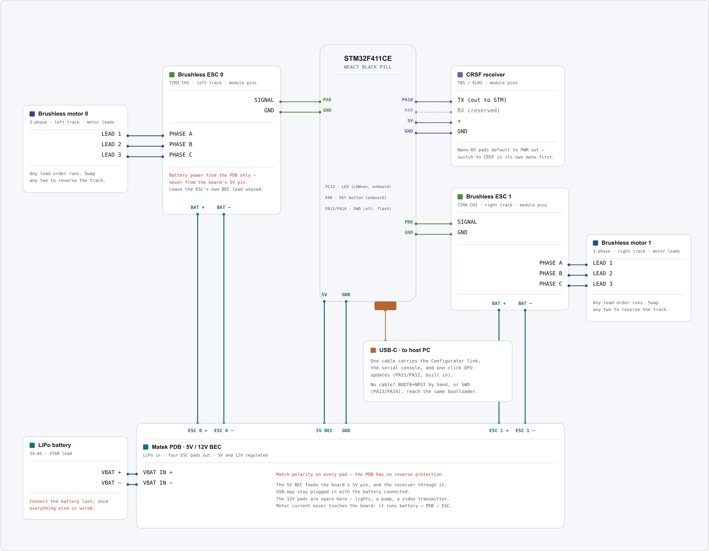

# Wiring

The battery feeds a power distribution board, the PDB feeds both ESCs and the board's 5V rail,
each ESC drives its motor on three wires, and the receiver and USB go straight to the board.

{target=_blank}

**Click the diagram to open it full size** in a new tab, where every pin label is readable.

This is a schematic map, not a picture of the board. Match connections by pin label, not by
position on the diagram.

## Pin map

| Signal | Board pin | Goes to |
|---|---|---|
| ESC 0 | PA6 | ESC 0 signal wire — the **left** track |
| ESC 1 | PB6 | ESC 1 signal wire — the **right** track |
| Receiver | PA10 | The receiver's CRSF **TX** pad |
| Receiver power | 5V, GND | The receiver's + and − |
| Board power | 5V, GND | The PDB's 5V BEC output |
| Status LED | PC13 | On the board already, nothing to wire |

PA9 is wired on the diagram but does nothing today. It is the board's CRSF transmit line,
reserved for sending telemetry back to your handset later.

Both ESC grounds connect to the board's ground.

## The power chain

Everything with current in it hangs off the PDB, and the board sits outside that path:

- **Battery → PDB.** The LiPo's XT60 goes to the PDB's battery input pads. Connect it last, once
  everything else is wired.
- **PDB → ESCs.** Each ESC's thick red and black leads solder to a pair of the PDB's ESC pads.
  Watch the polarity — a PDB has no reverse protection.
- **PDB → board.** The PDB's 5V BEC output goes to the board's 5V and GND pins. The receiver takes
  its power from the board's 5V pin in turn, so the BEC feeds it too.
- **ESC → motor.** Three wires per motor, in any order.

The 12V BEC output is spare in this build. It is there for lights, a pump, or a video transmitter
if you add one.

USB can stay plugged in with the battery connected — that is how you tune while the vehicle is on
the bench.

!!! warning "Power the ESCs from the PDB, never from the board's 5V pin"

    An ESC under load draws far more current than the board's 5V rail can supply. The board
    browns out, USB drops, and the app shows a disconnect — so it looks like a software or cable
    problem rather than the electrical one it is.

    The ESCs still need a **common ground** with the board, which the PDB's ground gives them. The
    signal wires have no reference without it, and the ESCs read noise.

    If your ESCs have their own BEC lead — the red wire on the servo connector — leave it
    disconnected. The PDB already supplies the board's 5V.

!!! warning "The receiver's pads ship in PWM mode"

    Out of the box, a receiver's output pads are configured as PWM servo outputs. One pad must be
    reassigned to CRSF in the receiver's own configuration menu. Until you do, nothing arrives on
    the wire at all and every channel reads empty — with no error to tell you why.

## Which track is which

`esc0` drives the left track and `esc1` the right. If they turn out swapped once you are driving,
you do not need to rewire: change `esc0.src` and `esc1.src` between `drive_left` and
`drive_right` in the app.

If a single track runs backwards, swap any two of the three motor wires on that ESC.

Next: [Flashing the firmware](flashing.md).
