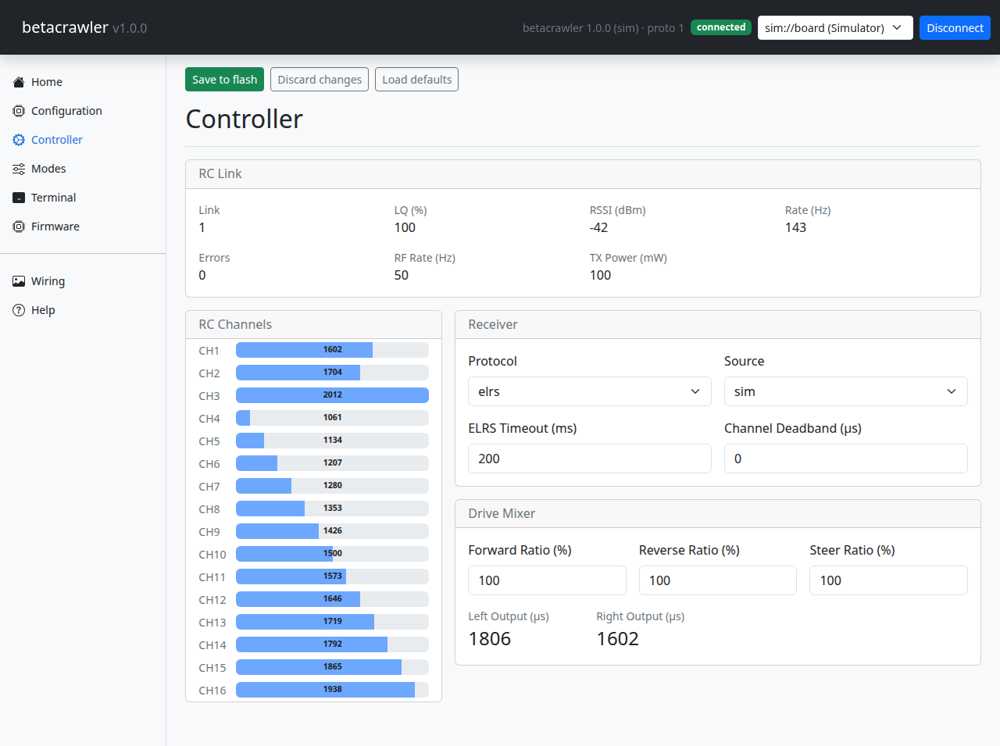
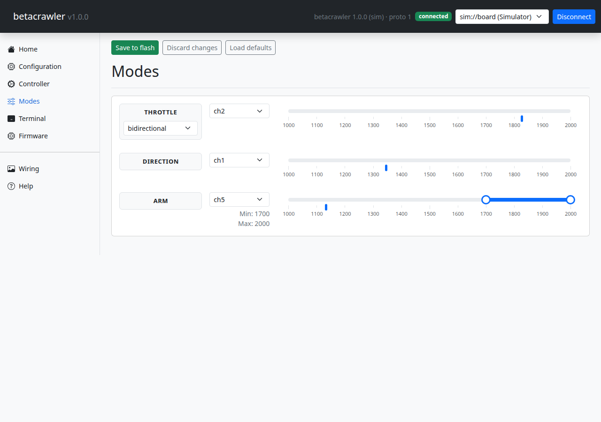

# First setup

This is the page that decides whether your vehicle drives properly. Work through it in order —
each step depends on the one before it.

!!! danger "Chock the tracks up off the ground"

    Until you have been all the way through this page at least once, prop the chassis up so the
    tracks spin free. An arming switch in the wrong place or a mis-assigned channel means the
    vehicle takes off across the room the moment it arms.

## 1. Bind the receiver

Bind the receiver to your handset using its own procedure — Betacrawler is not involved and
cannot help here.

## 2. Switch the receiver pad to CRSF

A receiver's output pads ship configured as PWM servo outputs. One must be reassigned to CRSF in
the receiver's own menu. Nothing arrives until you do, and there is no error message to tell you
so — the channels simply stay empty.

## 3. Set the protocol

On the **Controller** page, set **Protocol**:

- `elrs` — the default, and what you want for an ELRS receiver.
- `crossfire` — for a TBS Crossfire receiver.

## 4. Check the channels are arriving

The **RC Channels** panel shows every channel as a live bar. Move the sticks on your handset and
watch them move.

If nothing moves, stop here — steps 1 to 3 have not taken. Everything after this depends on the
channels arriving.

## 5. Assign the sticks

Still on **Controller**:

| Setting | Default | What it is |
|---|---|---|
| Throttle Src | `ch2` | Forwards and backwards |
| Steer Src | `ch1` | Left and right |

Those defaults suit a Mode 2 handset, which puts elevator on channel 2 and aileron on channel 1 —
the pair that falls under your thumbs. Change them if your handset differs.

Watch the **Left Output** and **Right Output** values as you move the sticks. Push throttle
forward and both should rise together; steer and they should move apart.

## 6. Set the arming switch

On the **Modes** page, the **ARM** row picks which switch arms the vehicle:

| Setting | Default | What it is |
|---|---|---|
| Arm Src | `ch5` | The channel your arming switch is on. `none` disables arming entirely. |
| Arm Min | 1700 µs | Bottom of the "armed" band |
| Arm Max | 2000 µs | Top of the "armed" band |

The defaults expect a two-position switch on channel 5, armed when flipped up. Flip your switch
and check the marker moves in and out of the highlighted band.

While disarmed, both ESC outputs are held at neutral no matter what the sticks do.

## 7. Set both ESCs to bidirectional

This one is done in **BLHeli Configurator**, not in Betacrawler. Connect each ESC in turn and set
its motor direction to **Bidirectional**.

The firmware already expects this: `esc0.direction` and `esc1.direction` both default to
`bidirectional`. If you skip it, the vehicle will only ever drive forwards.

## 8. Save

Press **Save to flash**.

Changes apply to the running board the instant you make them, but they live in RAM until you
save. Power-cycle without saving and you are back to where you started.

## 9. First drive

With the tracks still off the ground, arm and give it a little throttle. Check:

- Both tracks turn the same way for forward throttle.
- Steering makes them differ.
- Disarming stops both.

If one track runs backwards, swap any two motor wires on that ESC. If the two tracks are swapped
left-for-right, change `esc0.src` and `esc1.src` rather than rewiring.

Then put it on the ground and go to [Tuning](tuning.md).
