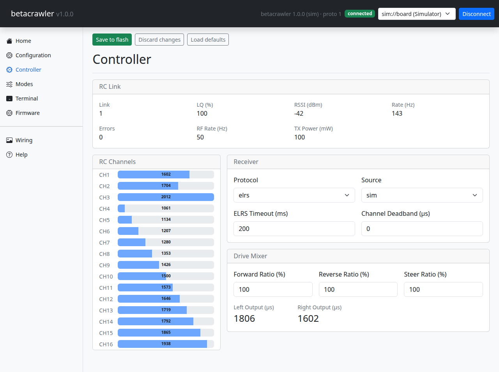
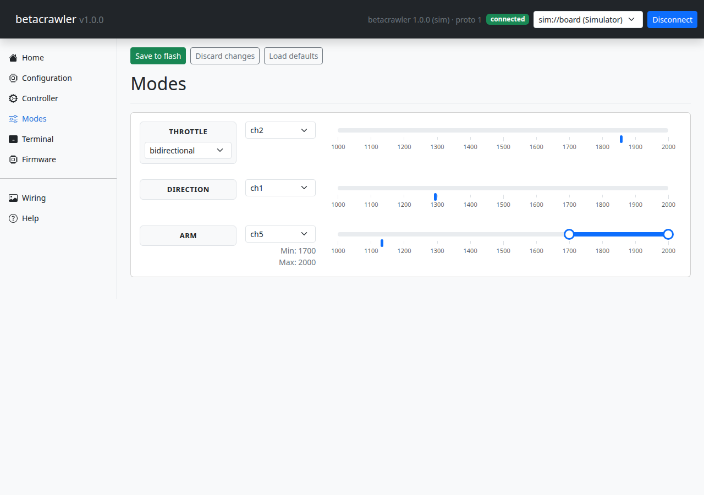

# First setup

This is the page that decides whether your vehicle drives properly. Work through it in order —
each step depends on the one before it.

!!! danger "Chock the tracks up off the ground"

    Until you have been all the way through this page at least once, prop the chassis up so the
    tracks spin free. An arming switch in the wrong place or a mis-assigned channel means the
    vehicle takes off across the room the moment it arms.

## 1. Bind the receiver

Bind the receiver to your handset using its own procedure — Betacrawler is not involved and
cannot help here.

## 2. Switch the receiver pad to CRSF

A receiver's output pads ship configured as PWM servo outputs. One must be reassigned to CRSF in
the receiver's own menu. Nothing arrives until you do, and there is no error message to tell you
so — the channels simply stay empty.

## 3. Set the protocol

On the **Controller** page, set **Protocol**:

- `elrs` — the default, and what you want for an ELRS receiver.
- `crossfire` — for a TBS Crossfire receiver.

## 4. Check the channels are arriving

The **RC Channels** panel shows every channel as a live bar. Move the sticks on your handset and
watch them move.

If nothing moves, stop here — steps 1 to 3 have not taken. Everything after this depends on the
channels arriving.

## 5. Pick the drive layout

On the **Configuration** page, set **Drive Mode**:

- **skid** — two driven sides that turn by running at different speeds. Tracks, a 4WD rover, a
  2WD skid-steer chassis. This is the default.
- **car** — one driven motor plus a steering servo.

The rest of this page assumes `skid`; the car build has its own step at the end.

## 6. Assign the sticks

Still on **Controller**:

| Setting | Default | What it is |
|---|---|---|
| Throttle Src | `ch2` | Forwards and backwards |
| Steer Src | `ch1` | Left and right |

Those defaults suit a Mode 2 handset, which puts elevator on channel 2 and aileron on channel 1 —
the pair that falls under your thumbs. Change them if your handset differs.

Watch the **Left Output** and **Right Output** values as you move the sticks. Push throttle
forward and both should rise together; steer and they should move apart. (In `car` mode these
read **Throttle Output** and **Steer Output**, and move independently.)

## 7. Set the arming switch

On the **Modes** page, the **ARM** row picks which switch arms the vehicle:

| Setting | Default | What it is |
|---|---|---|
| Arm Src | `ch5` | The channel your arming switch is on. `none` disables arming entirely. |
| Arm Min | 1700 µs | Bottom of the "armed" band |
| Arm Max | 2000 µs | Top of the "armed" band |

The defaults expect a two-position switch on channel 5, armed when flipped up. Flip your switch
and check the marker moves in and out of the highlighted band.

While disarmed, both ESC outputs are held at neutral no matter what the sticks do.

## 8. Set up your drive electronics

Both motors ship set to `off`, so a freshly flashed board drives nothing at all. That is
deliberate — it cannot know whether an ESC or an H-bridge is on the other end of the wire, and
the wrong guess turns a motor. Set `Type` to match your hardware **first**, then set each motor's
mode to `input`.

### If you're using brushless ESCs

A surface ESC (sold for cars or boats) needs nothing here — it already treats centre-stick as
stop.

A BLHeli_S drone ESC does: in **BLHeli Configurator**, not in Betacrawler, connect each ESC in
turn and set its motor direction to **Bidirectional**. Skip it and the ESC will not arm, because
it never sees the low throttle it waits for at power-on.

### If you're using brushed motors (H-Bridge)

No external configurator needed. On the **Configuration** page, set `Type` to `brushed` for both
motors, then press **Save to flash** before connecting the drive pack — with `Type` left on
`brushless` an H-bridge reads the ESC pulse train as a 30% duty cycle and both motors run. The
`off` mode default means a just-flashed board is safe until you set the mode, but set `Type`
before you do. Redo this after any
firmware update, which resets stored settings. If a motor spins the wrong way once you're driving, fix it with that motor's `Invert`
setting rather than re-wiring — see [Wiring for brushed motors](../build/wiring.md#wiring-for-brushed-motors-h-bridge).

## 9. If you are building a car

Skip this if your vehicle drives both sides. For one motor plus a steering servo:

1. **Configuration → Drive Mode** = `car`.
2. **Motor 0 → Source** = `drive_left` — that slot carries throttle in car mode.
3. **Servo → Mode** = `input` and **Source** = `drive_right` — the steer output.
4. Wire the servo signal to **PB10**, with its own 5&nbsp;V supply and a shared ground. Never run
   it from 3V3.

Then, with the wheels off the ground, check the steering:

- Turn the wheel or stick right. If the wheels go left, set **Servo → Invert** to `reversed`.
- With the stick centred, if the wheels sit off-straight, nudge **Servo → Trim** until they are.
  Negative values go the other way.

Motor 1 is unused on a single-motor car; leave its mode `off`.

## 10. Save

Press **Save to flash**.

Changes apply to the running board the instant you make them, but they live in RAM until you
save. Power-cycle without saving and you are back to where you started.

## 11. First drive

With the tracks still off the ground, arm and give it a little throttle. Check:

- Both tracks turn the same way for forward throttle.
- Steering makes them differ.
- Disarming stops both.

If one track runs backwards, swap any two motor wires on that ESC. If the two tracks are swapped
left-for-right, change `motor0.src` and `motor1.src` rather than rewiring.

Then put it on the ground and go to [Tuning](tuning.md).
