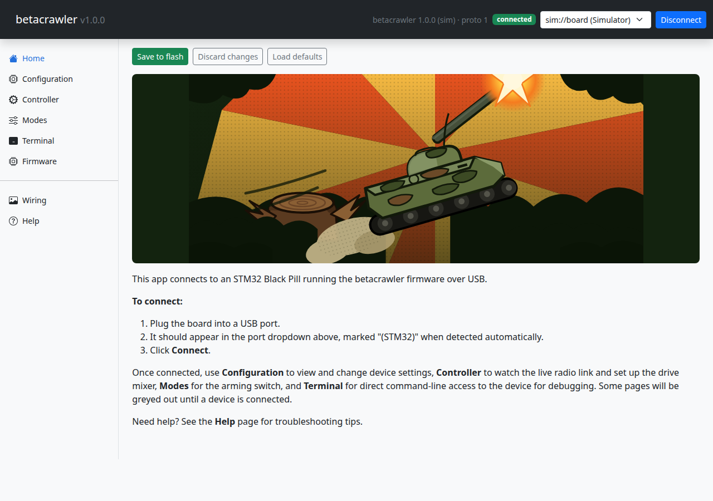

# Install and connect

The app is a small web server you run on your own machine. It talks to the board over USB and
serves the interface to your browser.

## First time only

Create the Python environment the server runs in:

```bash
python3 -m venv app/.venv
app/.venv/bin/pip install -r app/requirements.txt
```

## Starting it

```bash
./run-server.sh
```

Then open <http://127.0.0.1:9090>.

It runs in the foreground: logs appear in that terminal, and Ctrl+C stops it. To use a different
port:

```bash
PORT=9000 ./run-server.sh
```

## Connecting to the board



1. Plug the board into a USB port.
2. Pick it from the dropdown at the top right. A board running Betacrawler is labelled
   **(STM32)**.
3. Click **Connect**.

The badge next to the dropdown reads **connected** once it is talking to the board, along with
the firmware version it found.

## If there is no board yet

The dropdown also offers **Simulated board (no hardware)**. It is a fake device built into the
app that answers exactly as a real one would, so you can look around the interface before your
parts arrive. Nothing it reports is real.

## Pages that need a connection

Most pages grey out until a device is connected. **Firmware** deliberately does not — it is the
tool you need when a board is in a bad state, so it stays reachable.
