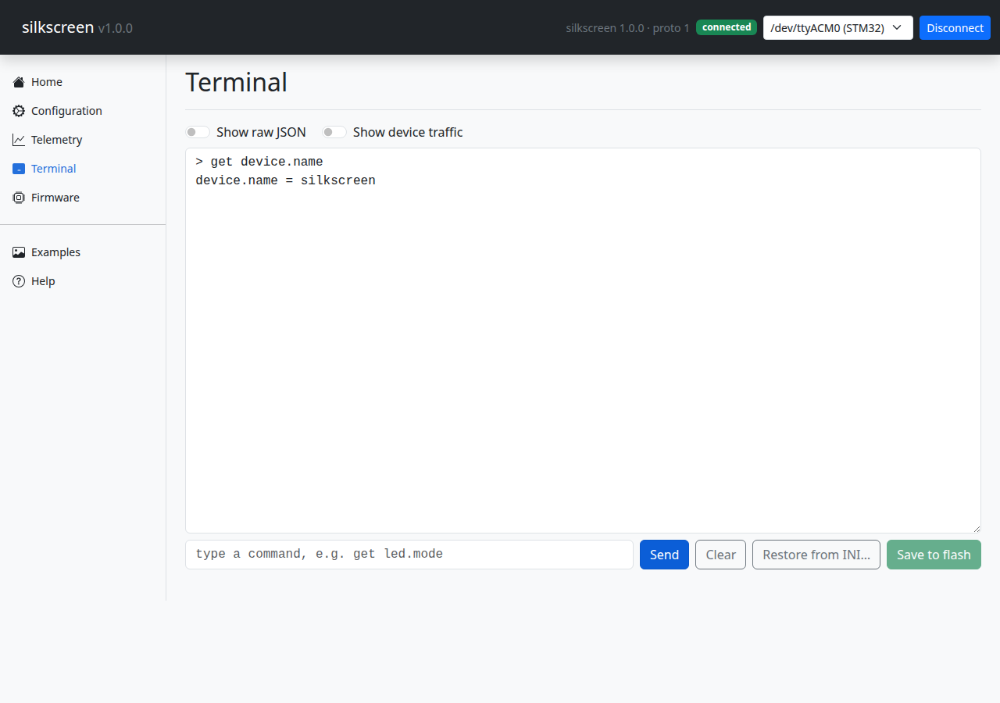
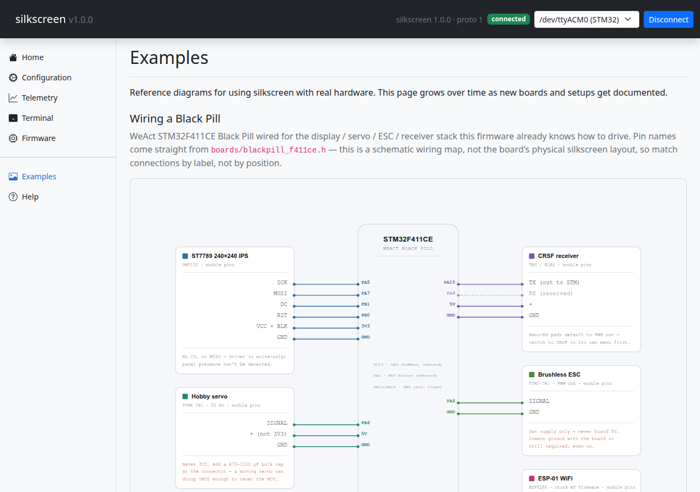
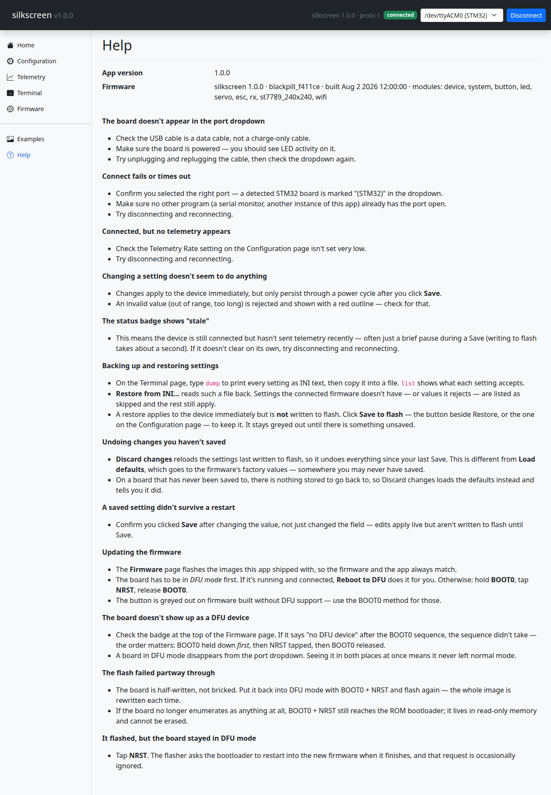

# Getting Started

## Prerequisites

| | |
|---|---|
| **VS Code** | with the **PlatformIO IDE** extension (`platformio.platformio-ide`) |
| **Python 3** | 3.10+ should be fine; developed and tested here against 3.14 |
| **A board** | WeAct Black Pill STM32F411CE (or edit one header for a different one) |
| **A USB-C cable** | a *data* cable — charge-only cables are the classic first hour lost |
| **ST-Link/V2** | only for the very first flash, and only if you skip the DFU path below |
| **dfu-util** | optional, for the in-app Firmware page (`apt install dfu-util`) |

PlatformIO brings its own compiler toolchain, so there is nothing else to install for the
firmware side.

**Linux permissions:** install PlatformIO's udev rules once, or the board will enumerate but
refuse to open:

```bash
curl -fsSL https://raw.githubusercontent.com/platformio/platformio-core/master/platformio/assets/system/99-platformio-udev.rules \
  | sudo tee /etc/udev/rules.d/99-platformio-udev.rules
sudo udevadm control --reload-rules && sudo udevadm trigger
```

That one file covers the board's USB serial port, the ST-Link and DFU mode, and tells
ModemManager to keep its hands off. Replug the board afterwards.

## 1. Clone and open the workspace

```bash
git clone <your-repo-url> silkscreen
cd silkscreen
code silkscreen.code-workspace
```

Open the **workspace file**, not the folder. It lists the repo root and `firmware/` as two
folders on purpose: PlatformIO only activates on a folder that has `platformio.ini` at its top
level, so `firmware/` has to be a workspace folder in its own right for the build buttons to
appear. VS Code will offer to install the recommended PlatformIO extension — accept, then
reload. The first activation downloads the STM32 toolchain and takes a few minutes.

## 2. Build and flash the firmware

With an ST-Link/V2 wired to the Black Pill's SWD pads (`3V3`, `SWDIO`/PA13, `SWCLK`/PA14,
`GND`), use the PlatformIO toolbar at the bottom of the window: **✓** builds, **→** uploads.
Or from a terminal:

```bash
cd firmware
~/.platformio/penv/bin/pio run -e blackpill_f411ce -t upload
```

`pio` is not on `PATH` after an IDE-only install — that full path is the reliable way to call it.

*No ST-Link?* You don't need one — do step 3 first, then flash over USB with dfu-util alone. See
[First flash without an ST-Link](troubleshooting.md#first-flash-without-an-st-link).

## 3. Build the firmware the app ships

`app/firmware/` holds the image the in-app **Firmware** page flashes. It is build output, not
source, so **a fresh clone does not have it** — run this once:

```bash
python3 app/tools/bundle_firmware.py blackpill_f411ce
```

Or **Terminal → Run Task → Build release firmware**. Re-run it after any firmware change worth
shipping; name every board you ship in the one command, since that command *is* the release. See
[Shipping a Release](guides/shipping-a-release.md) for details.

Skip this and everything else still works — the app just shows an empty Firmware page telling you
to run it.

## 4. Start the backend

From the workspace, run the pre-configured VS Code task: **Terminal → Run Task → Run backend
server**. It restarts cleanly over any instance it already left running. Or by hand:

```bash
python3 -m venv app/.venv
app/.venv/bin/pip install -r app/requirements.txt
./run-server.sh                      # http://127.0.0.1:8080
```

`run-server.sh` takes `PORT=9000` and passes extra arguments straight to uvicorn (`--reload`).

## 5. Connect

Open <http://127.0.0.1:8080>, pick the port and press Connect. The board appears as
`/dev/ttyACM0` on Linux, `COMx` on Windows, `/dev/cu.usbmodem*` on macOS; the picker marks ports
with ST's USB vendor id `0483` as **(STM32)**, so the right one is obvious. The UI then reads
the device's schema and builds itself.

## The pages

| Page | What it does |
|---|---|
| **Home**  | how to connect, and what the other pages are for |
| **Configuration**  | every parameter, grouped by module. **Save to flash** persists; **Load defaults** resets |
| **Telemetry**  | live values pushed from the board |
| **Terminal**  | hand-typed commands, optionally showing raw JSON and background device traffic. Also where settings backup (`dump`) and **Restore from INI…** live |
| **Firmware**  | flash the bundled image over USB DFU (or `esptool` on ESP32) |
| **Examples**  | reference wiring diagrams for real hardware setups |
| **Help**  | in-app troubleshooting — port not appearing, stale badge, settings not surviving a restart |

The connection badge and the firmware identity string sit in the top bar, visible from every
page. Terminal and Firmware deliberately work while **disconnected** — gating the recovery tool
on a working device would be exactly backwards.

## Running the tests

Neither suite needs a board attached.

```bash
cd firmware && ~/.platformio/penv/bin/pio test -e native
cd app && .venv/bin/pytest -q
```

The native suite compiles the *real* board header, so it assembles the actual device's parameter
and telemetry tables and diffs them against `firmware/test/golden/schema.json` — a firmware schema
change that isn't reflected there fails a test instead of drifting quietly. The Python suite runs
against a fake serial port. Only drivers, timing and boot ordering are outside both — that is the
part you verify by flashing the board.
