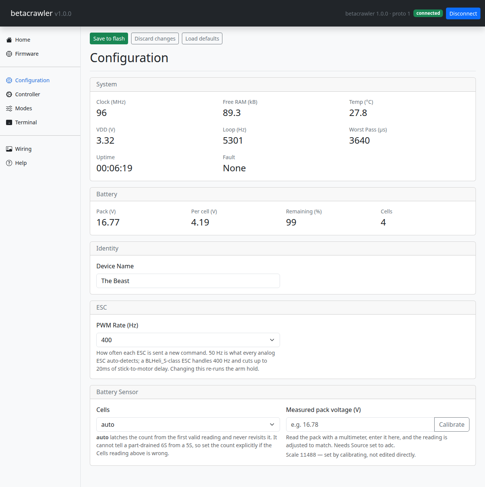
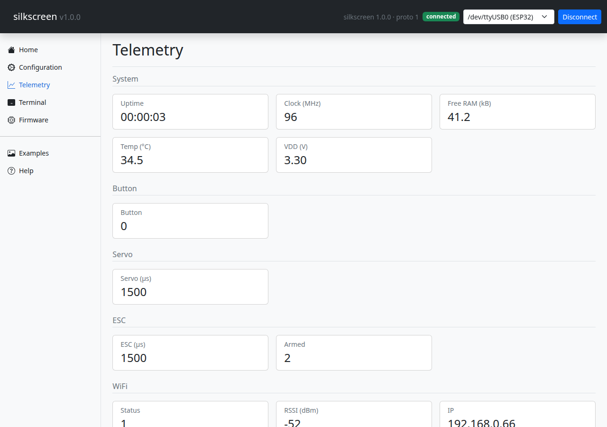

# betacrawler

**This project is currently under construction. If you want to contribute hit up our disscussion forum and get involved.**

----

A Betaflight-Configurator-style tool for small microcontroller boards, and a template to fork
for your own.

**[Read the full docs →](https://tropotek.github.io/betacrawler/)**

Adding a setting to the firmware makes a control appear
in the app. There is no second list to keep in sync.

Three tiers:

```
  STM32 board  ──USB serial──  Python backend  ──HTTP+WebSocket──  browser UI
  (firmware/)   JSON lines      (app/backend/)                      (app/web/)
```

The reference board is a WeAct **Black Pill (STM32F411CE)** with an LED, a button and an
optional ST7789 240x240 panel.

## What you get

- **Live config** — every firmware parameter as a form control, validated on the device as well
  as in the app. Values apply instantly; flash is written only when you press Save.
- **Telemetry** — pushed from the board at a configurable rate, rendered as cards.
- **Terminal** — type `get led.mode`, `set led.blink_hz 5`, `save`; see the raw JSON both ways.
- **Firmware updates in-app** — the app carries an image matching its own version and flashes it
  over USB DFU (or `esptool` on ESP32), no ST-Link needed after the first time.
- **Settings backup/restore** as INI files.
- **An on-device dashboard** on the optional SPI panel.

## See it in action

| | |
|---|---|
|  |  |
| Configuration — every parameter across every module, built from the firmware schema alone | Telemetry — live values pushed from the board |

## Quickstart

```bash
git clone <your-repo-url> betacrawler
cd betacrawler
code betacrawler.code-workspace
```

Open the workspace file, install the recommended PlatformIO extension when VS Code offers it, and
follow **[Getting Started](https://tropotek.github.io/betacrawler/getting-started/)** in the docs
for the full walkthrough — building/flashing the firmware, starting the backend, and connecting.

## Making it yours

Forking betacrawler for your own board? Start with:

- **[Adding a Board](https://tropotek.github.io/betacrawler/guides/adding-a-board/)** — port to
  different hardware, no source file changes for an STM32 board.
- **[Adding Your Own Module](https://tropotek.github.io/betacrawler/modules/adding-your-own-module/)**
  — add a new behavior or peripheral driver.
- `firmware/docs/` and `app/docs/` — placeholder templates for *your* project's own bill of
  materials, assembly instructions and user guide, ready to fill in.

**Rename it.** `FW_PROJECT_NAME` in `firmware/include/config.h` is the one string to change; the
device name default, the identity reported over the wire and the firmware bundle's filename all
derive from it. The app's version lives separately at the top of `app/web/app.js` — firmware and
app version independently.

## Layout

```
firmware/include/       config.h (identity, limits) and boards/<board>.h (FEATURE_* + pins)
firmware/src/core/      pure C++, zero Arduino: protocol, params, registry, dispatch. Unit-tested
firmware/src/features/  behaviours, one folder per module
firmware/src/hardware/  device drivers, one folder per module
firmware/src/modules.cpp  the wiring file — one #if block per module
firmware/docs/          placeholder templates for your fork's own BOM/assembly docs

app/backend/            protocol.py → link.py → device.py → main.py (FastAPI)
app/firmware/           the images this app ships with, plus manifest.json. Gitignored: it is
                        built by a script, not committed
app/tools/              bundle_firmware.py, run by hand at release time
app/web/                static HTML/JS, no build step
app/docs/               placeholder template for your fork's own user guide

docs/                   full documentation site — architecture, API, guides, module reference
CLAUDE.md               architecture notes and the reasoning behind the design
```

The web UI talks to the backend exclusively through the `Api` object in `app.js` — the entire
porting surface if you ever want an Electron build.

## Running the tests

Neither suite needs a board attached.

```bash
cd firmware && ~/.platformio/penv/bin/pio test -e native
cd app && .venv/bin/pytest -q
```

The native suite compiles the *real* board header, so it assembles the actual device's parameter
and telemetry tables and diffs them against `firmware/test/golden/schema.json`. The Python suite
runs against a fake serial port. See
**[Running the tests](https://tropotek.github.io/betacrawler/getting-started/#running-the-tests)**
in the docs for more.

## License

Copyright (C) 2026 Micks Shed

This program is free software: you can redistribute it and/or modify it under the terms of the
**GNU General Public License, version 3** or (at your option) any later version, as published by
the Free Software Foundation. It is distributed in the hope that it will be useful, but **without
any warranty** — without even the implied warranty of merchantability or fitness for a particular
purpose. See [`LICENSE`](LICENSE) for the full text, or <https://www.gnu.org/licenses/>.

That covers the firmware, the backend and the web UI. If you fork this as the base for your own
board, the GPL comes with it: distributing a device running derived firmware means offering the
corresponding source to whoever you gave the device to.

Third-party components keep their own licenses and are not covered by the above: Bootstrap and
Alpine.js (both MIT) are vendored in `app/web/vendor/`, and ArduinoJson (MIT), the GFX Library
for Arduino and the STM32 Arduino core are pulled in at build time by PlatformIO. All are
GPL-compatible.
